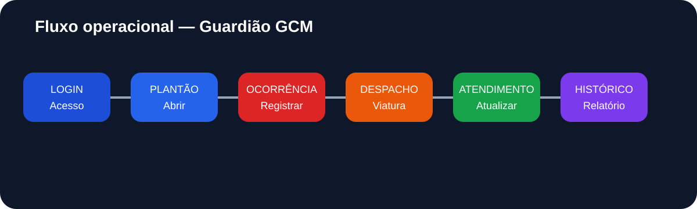
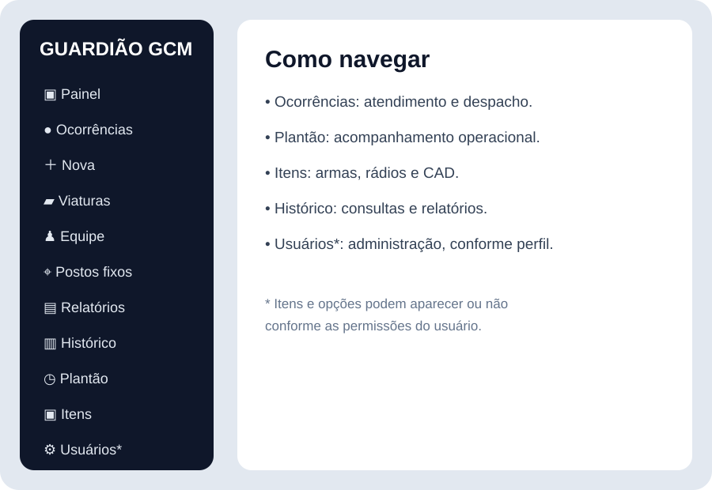
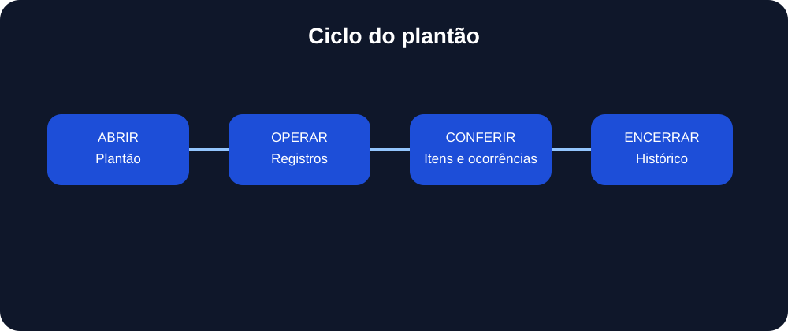
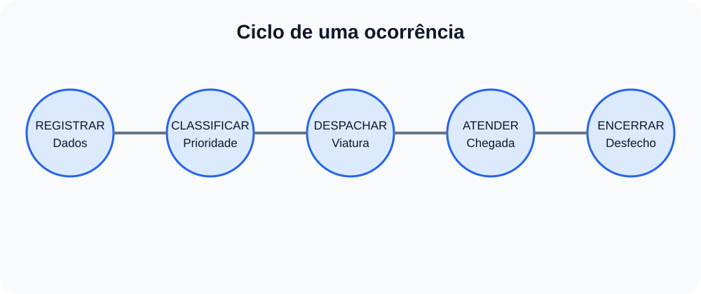
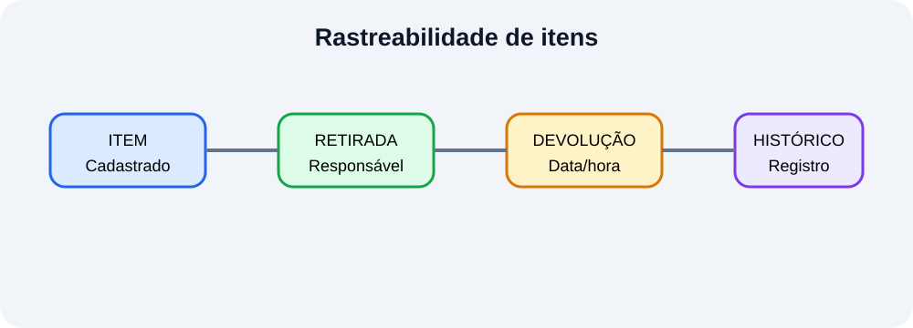

# 🛡️ Guardião GCM — Manual do Usuário

## CAD — Central de Atendimento e Despacho
### Guarda Civil Municipal de Araçoiaba da Serra — SP

> **Objetivo deste manual:** orientar, passo a passo e em linguagem operacional, os usuários do Guardião GCM sobre acesso, plantão, ocorrências, despacho, viaturas, equipe, postos, itens, relatórios, histórico e administração de usuários.

**Versão de referência:** branch `main` do repositório, 07/10/2026.

---

## 1. Visão geral

O **Guardião GCM** centraliza o registro e o acompanhamento das atividades operacionais em um único ambiente.

A operação é organizada em torno de alguns princípios:

- **Registrar:** tudo o que precisa permanecer documentado deve ser lançado no sistema.
- **Atualizar:** registros operacionais devem acompanhar a evolução real do atendimento.
- **Rastrear:** alterações, responsáveis, horários e movimentações devem permanecer vinculados aos registros.
- **Encerrar corretamente:** ocorrências e plantões devem ser finalizados somente após conferência.
- **Respeitar permissões:** cada usuário visualiza e executa as funções compatíveis com seu perfil.

### Fluxo recomendado

---

# 2. Antes de começar

## 2.1 Requisitos

O sistema é web e pode ser utilizado em computador, tablet ou celular compatível com navegador moderno.

Para uma operação mais confortável:

- prefira computador na central;
- mantenha o navegador atualizado;
- use conexão confiável;
- não compartilhe sua sessão;
- em dispositivo compartilhado, saia da conta ao terminar.

O projeto também possui estrutura de **PWA**, permitindo instalação em navegadores compatíveis.

> **Atenção:** o PWA melhora a experiência de acesso, mas não transforma operações dependentes do backend em funcionamento totalmente offline.

---

# 3. Primeiro acesso

## 3.1 Cadastro

Na tela pública, utilize a opção de solicitação de cadastro quando disponível.

O cadastro solicita informações de identificação e credenciais, incluindo:

- nome completo;
- matrícula, quando aplicável;
- e-mail;
- senha;
- aceite dos Termos de Uso e da Política de Privacidade.

A senha deve atender às regras apresentadas pelo próprio sistema.

### Depois de enviar o cadastro

O fluxo normal é:

**Cadastro → confirmação de e-mail → análise/aprovação administrativa → acesso**

Um usuário recém-cadastrado não deve presumir que já possui autorização operacional.

---

## 3.2 Confirmação do e-mail

Se o sistema solicitar confirmação:

1. abra a caixa de entrada do e-mail informado;
2. procure a mensagem de confirmação;
3. verifique também spam/lixo eletrônico e outras categorias;
4. utilize o link de confirmação;
5. retorne ao sistema e faça login.

Se a mensagem não chegar, utilize a opção de reenvio disponibilizada na tela.

---

# 4. Login e sessão

Na tela de acesso:

1. informe seu e-mail;
2. informe sua senha;
3. confirme o acesso.

### Boas práticas

- não entregue sua senha a outro operador;
- não mantenha a sessão aberta em computador público;
- não utilize a conta de outra pessoa;
- se suspeitar de acesso indevido, comunique a administração.

---

# 5. Navegação principal

A navegação varia de acordo com o perfil do usuário.

Em linhas gerais, os módulos são:

| Módulo | Finalidade |
|---|---|
| **Painel** | visão operacional/resumo do sistema |
| **Ocorrências** | acompanhamento de atendimentos e despacho |
| **Nova** | abertura de ocorrência |
| **Viaturas** | disponibilidade e cadastro operacional |
| **Equipe** | profissionais e composição operacional |
| **Postos fixos** | pontos/postos de atendimento |
| **Relatórios** | indicadores e consultas |
| **Histórico** | plantões finalizados e documentos |
| **Plantão** | operação do turno |
| **Itens** | armas, rádios e CAD |
| **Usuários** | administração de contas, quando autorizado |

> **Importante:** menus, botões e ações administrativas podem aparecer ou desaparecer conforme o perfil de acesso.

---

# 6. Painel operacional

O painel é a área de visão geral.

Use-o para obter uma leitura rápida do estado operacional e navegar para os módulos que exigem ação.

O painel **não substitui o registro detalhado**. Quando uma atividade precisar ser documentada, abra o módulo correspondente e faça o lançamento.

---

# 7. Plantão — centro da operação

O **Plantão** representa o período operacional em andamento.

## 7.1 Abrir o plantão

Ao iniciar o serviço:

1. entre em **Plantão**;
2. confira se existe um plantão em andamento;
3. se necessário, abra o plantão;
4. confirme a equipe e as informações solicitadas;
5. confira as informações antes de iniciar a operação.

Evite abrir vários plantões para o mesmo período.

---

## 7.2 Durante o plantão

O plantão pode concentrar informações como:

- operador responsável;
- supervisor;
- operador de rádio;
- equipe;
- horário;
- guarnições;
- postos;
- atividades;
- materiais;
- informativos;
- registros manuais;
- observações;
- atualizações operacionais.

### Atualização em tempo real

A funcionalidade **Atualização em tempo real** pertence ao contexto do **Plantão**.

Use-a para registrar informações operacionais que precisam acompanhar a evolução do serviço.

Não confunda:

- **Ocorrência:** atendimento individual;
- **Plantão:** contexto geral do turno.

---

## 7.3 Conferência antes de encerrar

Antes de fechar o plantão:

- confira ocorrências ainda abertas;
- confira registros importantes;
- confira itens retirados;
- confirme devoluções;
- revise observações;
- verifique se as informações essenciais estão corretas;
- gere/visualize o relatório quando necessário.

---

## 7.4 Encerramento

Ao encerrar:

1. revise os dados;
2. execute o comando de encerramento;
3. aguarde a confirmação;
4. consulte **Histórico** para confirmar que o plantão foi finalizado.

> Se um plantão não aparecer no histórico, primeiro confira o filtro de período e atualize a página.

### Administração

Usuários com permissão administrativa podem possuir ações adicionais sobre plantões, inclusive tratamento de registros que não estejam mais sob o operador original.

---

# 8. Ocorrências

O módulo de ocorrências documenta o atendimento desde o recebimento até o desfecho.

## 8.1 Abrir uma ocorrência

Acesse **Nova**.

Preencha os dados solicitados com o máximo de precisão possível.

Dependendo do formulário, podem ser solicitados:

- natureza;
- prioridade;
- origem;
- dados do solicitante;
- endereço;
- número;
- bairro;
- referência;
- relato/descrição;
- envolvidos;
- outras informações operacionais.

### Regra de ouro

**Não invente informações.**

Se um dado não estiver disponível, utilize a opção adequada apresentada pelo sistema ou registre a informação disponível de forma objetiva.

---

## 8.2 Salvar

Antes de salvar, confira:

- natureza correta;
- prioridade correta;
- local correto;
- descrição compreensível;
- dados do solicitante;
- informações dos envolvidos, quando existentes.

Depois do salvamento, o sistema gera/associa um identificador/protocolo para acompanhamento.

---

# 9. Despacho de viatura

Depois de registrar a ocorrência, utilize a área de detalhe da ocorrência para executar as ações permitidas.

Quando o despacho estiver disponível:

1. abra a ocorrência;
2. localize a área de despacho;
3. selecione uma viatura elegível/disponível;
4. confirme o despacho;
5. acompanhe a evolução do atendimento.

Não selecione uma viatura indisponível ou já comprometida com outra atividade.

---

# 10. Chegada ao local

Quando a equipe chegar:

1. abra a ocorrência correspondente;
2. registre a chegada pelo comando disponível;
3. confirme o horário registrado;
4. continue o atendimento.

A chegada é importante para manter a cronologia operacional correta.

---

# 11. Histórico da ocorrência

Durante o atendimento, podem ser adicionadas observações e eventos.

Use o histórico para manter a sequência dos fatos clara.

Prefira registros:

- objetivos;
- cronológicos;
- profissionais;
- sem comentários pessoais;
- sem abreviações que prejudiquem a compreensão.

---

# 12. Encerramento da ocorrência

Quando o atendimento terminar:

1. confira se o desfecho está correto;
2. registre o resultado;
3. inclua observações necessárias;
4. encerre a ocorrência.

> Uma ocorrência encerrada não deve ser reaberta ou alterada sem observar as permissões e os procedimentos administrativos aplicáveis.

Usuários com função de supervisão/administração podem possuir ações adicionais.

---

# 13. Boletim e impressão da ocorrência

Quando a ocorrência disponibilizar a opção de impressão:

1. abra o detalhe;
2. revise os dados;
3. acione **Imprimir boletim** ou a opção equivalente;
4. o documento será aberto em uma nova área/aba;
5. utilize a impressão do navegador para imprimir ou salvar em PDF.

### Antes de imprimir

Confira principalmente:

- protocolo;
- natureza;
- horários;
- viatura;
- envolvidos;
- local;
- desfecho;
- observações.

**O documento impresso deve ser conferido antes de ser utilizado oficialmente.**

---

# 14. Viaturas

A área **Viaturas** concentra informações das viaturas utilizadas na operação.

Podem ser consultados, conforme os dados cadastrados:

- prefixo;
- placa;
- modelo;
- guarnição;
- status;
- disponibilidade;
- quilometragem;
- demais informações administrativas/operacionais.

## 14.1 Pesquisa

Utilize a pesquisa e os filtros disponíveis para localizar rapidamente a viatura.

Pesquise preferencialmente por um identificador conhecido, como prefixo ou placa.

## 14.2 Status

O status da viatura deve refletir sua situação operacional real.

Antes de despachar:

**confirme se a viatura está disponível.**

Alterações administrativas de cadastro/status dependem da permissão do usuário.

---

# 15. Equipe

A área **Equipe** mantém o cadastro dos profissionais utilizados nas escalas e operações.

Podem existir informações como:

- nome;
- matrícula;
- tipo;
- função/cargo;
- observações;
- situação ativa/inativa.

Use os dados exatamente como cadastrados pela administração.

Alterações de equipe devem ser feitas somente por usuários autorizados.

---

# 16. Escalas

Quando disponível para o perfil:

- consulte a escala;
- verifique a composição;
- confirme quem está vinculado ao serviço;
- mantenha os dados coerentes com a operação real.

A escala é uma referência operacional e não substitui o registro efetivo do plantão.

---

# 17. Postos fixos

O módulo **Postos fixos** permite consultar e administrar pontos de atendimento/guarda cadastrados.

Podem existir categorias como:

- escolas;
- unidades de saúde;
- hospitais;
- prédios públicos;
- praças/parques;
- terminais;
- cemitérios;
- outros locais definidos pela administração.

### Consulta

Utilize:

- busca;
- bairro;
- endereço;
- tipo de posto;
- filtros disponíveis.

As informações cadastradas podem incluir:

- endereço;
- telefone;
- responsável;
- horário;
- cobertura;
- equipe/agentes vinculados;
- observações.

---

# 18. Itens operacionais

O menu **Itens** reúne o controle de materiais operacionais.

Submódulos:

- **Armas**
- **Rádios**
- **CAD**

## 18.1 Armas

O controle deve permitir identificar a movimentação do item durante o serviço.

Fluxo:

**Item cadastrado → retirada → responsável → utilização → devolução → histórico**

Antes da retirada:

1. confira a identificação;
2. confira a condição;
3. selecione o responsável correto;
4. registre a retirada.

Ao devolver:

1. confirme o item;
2. registre a devolução;
3. confira a condição;
4. confirme que o movimento foi concluído.

---

# 19. Rádios

O procedimento é semelhante ao controle de armas:

1. localizar o rádio;
2. confirmar a identificação;
3. indicar o responsável;
4. registrar a retirada;
5. utilizar durante o serviço;
6. registrar a devolução;
7. conferir a situação final.

### Regra importante

Um equipamento que já possua uma movimentação aberta não deve ser retirado novamente como se estivesse disponível.

---

# 20. CAD e demais itens

O submódulo **CAD** é destinado aos itens cadastrados para controle administrativo/operacional.

Durante a conferência, utilize o estado apresentado pelo sistema, como:

- **OK**
- **AVARIADO**
- **EXTRAVIADO**
- **AUSENTE**

A classificação deve refletir a situação encontrada.

---

# 21. Rastreabilidade dos itens

A rastreabilidade permite responder:

**Qual item? → Quem retirou? → Quando? → Em qual plantão? → Foi devolvido? → Quando?**

Não altere manualmente a responsabilidade de um item para “corrigir” uma movimentação sem seguir o procedimento administrativo.

---

# 22. Relatórios

O módulo **Relatórios** permite analisar informações operacionais de acordo com os recursos disponíveis para o usuário.

Podem existir filtros e indicadores relacionados a:

- período;
- faixa de horário;
- natureza;
- bairro;
- situação;
- origem;
- quantidade de registros;
- distribuição temporal.

### Como usar

1. selecione os filtros;
2. confira o período;
3. aplique a consulta;
4. analise os indicadores;
5. utilize o resultado como apoio à gestão.

> Relatórios são instrumentos de análise. O registro individual da ocorrência/plantão continua sendo a fonte operacional correspondente.

---

# 23. Histórico

O **Histórico** é utilizado para consultar registros de plantões já encerrados.

## 23.1 Localizar um plantão

1. abra **Histórico**;
2. selecione o período/mês, quando houver filtro;
3. atualize a consulta;
4. localize o plantão.

Se o registro não aparecer:

- confira o mês selecionado;
- atualize a página;
- confirme que o plantão foi realmente encerrado;
- confirme que você possui permissão para visualizá-lo.

---

# 24. Visualizar e imprimir relatório de plantão

Quando disponível:

1. abra o plantão no Histórico;
2. escolha **Visualizar**;
3. confira o relatório;
4. utilize a impressão do navegador;
5. escolha impressora ou **Salvar como PDF**.

O relatório deve ser conferido antes da impressão definitiva.

### Atenção à diferença entre ações

- **Visualizar:** consulta/documentação.
- **Editar:** alteração, quando autorizada.

Se os dois comandos apresentarem comportamentos iguais ou inesperados, não tente corrigir o registro manualmente: comunique a administração/técnico responsável.

---

# 25. Perfil do usuário

A área **Perfil** permite administrar os dados da própria conta conforme os recursos habilitados.

Pode incluir:

- nome;
- matrícula;
- alteração de senha;
- dados da conta.

### Troca de senha

Utilize uma senha forte e exclusiva.

Nunca compartilhe a senha.

---

# 26. Usuários e permissões

O módulo **Usuários** é administrativo.

### Perfis

Em termos operacionais, o sistema trabalha com diferentes níveis de acesso, incluindo:

| Perfil | Uso geral |
|---|---|
| **Operador** | operação cotidiana e funções autorizadas |
| **Supervisor** | operação + funções de supervisão |
| **Administrador** | administração ampla do sistema |

As permissões efetivas são determinadas pelo sistema e pelas regras de segurança do backend.

---

## 26.1 Aprovação de usuários

Quando houver usuários pendentes:

1. abra **Usuários**;
2. consulte os pendentes;
3. confira os dados;
4. aprove ou rejeite conforme o procedimento da corporação.

Não aprove uma conta sem verificar a identidade/autorização correspondente.

---

## 26.2 Criação/edição

Ao criar ou editar usuários:

- informe dados corretos;
- atribua somente o perfil necessário;
- evite conceder privilégios administrativos sem necessidade;
- confirme a operação antes de salvar.

---

# 27. Temas e aparência

O sistema pode disponibilizar temas visuais, incluindo opções como:

- Escuro;
- Claro;
- Cyberpunk;
- Oceano;
- Floresta.

A disponibilidade pode variar conforme a versão.

A escolha visual não altera as permissões ou os registros operacionais.

---

# 28. Uso em celular e PWA

Em navegadores compatíveis, o Guardião GCM pode ser instalado como aplicativo.

### Vantagens

- acesso mais rápido;
- aparência de aplicativo;
- ícone próprio;
- abertura em modo dedicado;
- atualização automática dos recursos quando disponível.

### Cuidados

Instalação como PWA **não significa que o banco de dados esteja armazenado no aparelho**.

Operações que dependem de autenticação, banco ou sincronização precisam de conectividade adequada.

---

# 29. Segurança operacional

## Nunca faça

- compartilhe sua senha;
- empreste sua conta;
- use conta de outro agente;
- registre informação falsa;
- altere registro para esconder erro;
- deixe a sessão aberta em equipamento compartilhado;
- copie dados operacionais para aplicativos pessoais sem autorização;
- envie documentos operacionais para destinatários não autorizados.

## Faça sempre

- confira os dados antes de salvar;
- use sua própria conta;
- registre fatos objetivamente;
- encerre a sessão quando necessário;
- comunique erros;
- comunique suspeitas de acesso;
- confira itens antes e depois do plantão.

---

# 30. Checklist de início do plantão

Use esta sequência como rotina:

- [ ] Entrar com a própria conta.
- [ ] Confirmar o perfil correto.
- [ ] Abrir/conferir o plantão.
- [ ] Conferir supervisor/operador/equipe.
- [ ] Conferir viaturas.
- [ ] Conferir postos, quando aplicável.
- [ ] Conferir armas.
- [ ] Conferir rádios.
- [ ] Conferir itens CAD.
- [ ] Verificar observações/informativos.
- [ ] Confirmar que a atualização do plantão está funcionando.

---

# 31. Checklist durante o plantão

- [ ] Registrar cada ocorrência.
- [ ] Classificar corretamente.
- [ ] Despachar viatura disponível.
- [ ] Registrar chegada.
- [ ] Atualizar o atendimento.
- [ ] Registrar o desfecho.
- [ ] Manter observações objetivas.
- [ ] Registrar movimentação de itens.
- [ ] Manter o plantão atualizado.
- [ ] Corrigir inconsistências pelos meios autorizados.

---

# 32. Checklist de encerramento

Antes de fechar:

- [ ] Todas as ocorrências foram revisadas?
- [ ] Existe ocorrência ainda em atendimento?
- [ ] Todas as viaturas estão com status correto?
- [ ] Armas foram conferidas?
- [ ] Rádios foram conferidos?
- [ ] Itens CAD foram conferidos?
- [ ] Observações importantes foram registradas?
- [ ] Relatório foi revisado?
- [ ] Plantão foi encerrado?
- [ ] Plantão aparece no Histórico?

---

# 33. Solução de problemas

## “Não consigo entrar”

Confira:

1. e-mail;
2. senha;
3. confirmação do e-mail;
4. aprovação da conta;
5. conexão;
6. se a página precisa ser atualizada.

---

## “Fiz cadastro, mas não consigo operar”

A conta pode estar aguardando confirmação ou aprovação administrativa.

Não crie contas duplicadas sem orientação.

---

## “Não recebi o e-mail”

Confira:

- spam;
- lixo eletrônico;
- promoções;
- endereço digitado;
- opção de reenvio.

---

## “Meu plantão não aparece no Histórico”

Verifique:

1. mês/período selecionado;
2. se o plantão foi encerrado;
3. atualização da página;
4. permissões da conta.

---

## “Não consigo despachar uma viatura”

Verifique:

- se a viatura está ativa;
- se está disponível;
- se já está vinculada a outro atendimento;
- se seu perfil possui a permissão necessária.

---

## “Um rádio/arma não pode ser retirado”

Provavelmente existe uma movimentação aberta ou o item não está disponível.

Confira o histórico/movimentação antes de tentar novamente.

---

## “Não vejo Usuários”

Essa área é restrita a perfis administrativos.

---

## “Uma ação que eu tinha desapareceu”

Verifique o perfil da conta e se a operação realmente está autorizada para aquele usuário.

Não tente contornar a permissão pela URL ou por ferramentas do navegador.

---

# 34. Procedimento em caso de erro

Se ocorrer um erro:

1. não repita muitas vezes uma operação sensível;
2. anote o que estava fazendo;
3. registre o horário;
4. faça uma captura de tela se permitido;
5. informe a mensagem exibida;
6. comunique a administração/técnico responsável.

Quanto mais precisa for a descrição, mais fácil será identificar a causa.

---

# 35. Glossário rápido

**CAD** — Central de Atendimento e Despacho.

**Plantão** — período operacional registrado no sistema.

**Ocorrência** — atendimento individual que precisa ser registrado e acompanhado.

**Despacho** — encaminhamento de recurso/equipe para uma ocorrência.

**Chegada** — registro da chegada da equipe ao local.

**Desfecho** — resultado final do atendimento.

**Histórico** — consulta de registros anteriores.

**Viatura** — recurso móvel utilizado na operação.

**Posto fixo** — local cadastrado para presença/atendimento.

**Item** — recurso controlado, como arma, rádio ou equipamento CAD.

**PWA** — aplicativo web instalável.

**Administrador** — perfil com permissões administrativas ampliadas.

**Supervisor** — perfil com funções adicionais de supervisão.

**Operador** — perfil destinado à operação cotidiana autorizada.

---

# 36. Regras de ouro para o operador

### 1. Registre o fato, não a opinião.
### 2. Atualize o sistema conforme a operação evolui.
### 3. Nunca use a conta de outro usuário.
### 4. Confira antes de salvar.
### 5. Confira antes de encerrar.
### 6. Confira os itens no início e no fim do plantão.
### 7. Use o Histórico para confirmar o encerramento.
### 8. Em dúvida, não improvise: consulte a supervisão.
### 9. Proteja informações operacionais.
### 10. A segurança do sistema depende também do comportamento do usuário.

---

# 37. Referências do projeto

- [Repositório do Guardião GCM](https://github.com/DevKove/guardiaogcm)
- [Sistema publicado](https://devkove.github.io/guardiaogcm/)
- [Termos de Uso](TERMOS-DE-USO.md)
- [Política de Privacidade](POLITICA-DE-PRIVACIDADE.md)
- [Política de Segurança](SECURITY.md)

---

## Observação final

Este manual foi estruturado a partir dos módulos e fluxos presentes no projeto. Como o Guardião GCM está em desenvolvimento contínuo, **nomes de botões, campos, permissões e telas podem mudar entre versões**.

Em caso de divergência entre este documento e a interface, deve ser considerada a versão efetivamente publicada e as orientações operacionais da administração.

---

<strong>🛡️ Guardião GCM</strong> CAD — Central de Atendimento e Despacho Guarda Civil Municipal de Araçoiaba da Serra — SP

